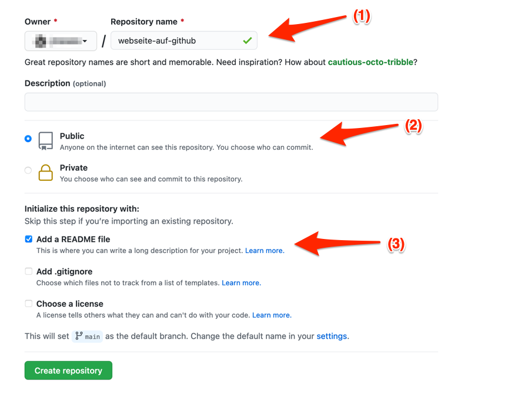

Nach dem Einloggen auf der GitHub Webseite sieht man rechts oben ein Plus-Symbol.
Wenn man dort drauf klickt öffnet sich ein Kontext-Menü, worin man dann "New repository" auswählen kann.

Daraufhin öffnet sich eine Seite mit einem Formlar zu den Details für das neue Repository.

Wichtig hierbei ist neben einem Name für das Repository, ob es öffentlich oder privat sein soll.
Öffentlich heißt, jede/r der Ihr Profil auf der GitHub Webseite besucht kann es sehen.
Privat heißt, nur Sie können das Repository sehen, und jene welchen Sie ggf. später die Berechtigung dafür geben.

1. Tragen Sie hier einen Namen für das Repository ein, z.B. "webseite-auf-github", in einem nachfolgenden Tutorial eine kleine Webseite hierin publiziert werden soll.
2. Für diese Übung wählen Sie bitte "Public" aus.
3. In den Optionen für die Sektion "Initialize this repository with", wählen Sie bitte "Add a README file" aus.

Danach können Sie das Anlegen des Repository mit einem Klick auf den "Create repository" button bestätigen.
