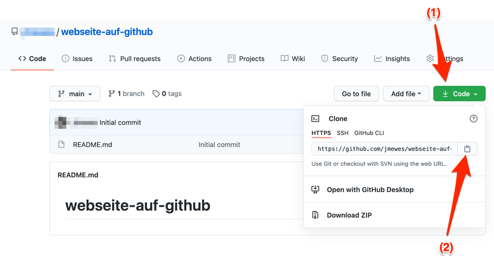

Das Herunterladen von Git Repositories auf den lokalen Rechner wird als "clone" bezeichnet.
Um dies im nächsten Schritt durchzuführen, kopieren Sie die "Clone URL" in den Zwischenspeicher, indem Sie auf der Repository-Hauptseite auf den grünen "Code" Button klicken (1), und danach auf das Kopier-Icon (2).

