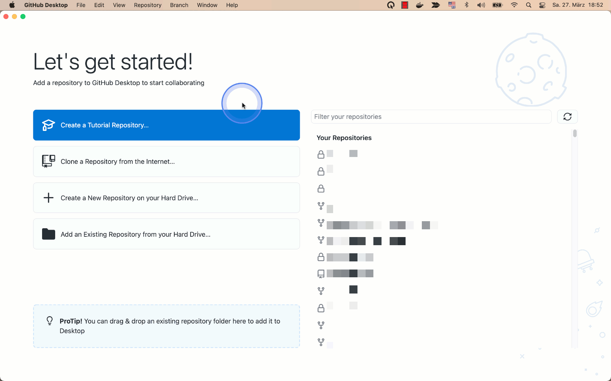
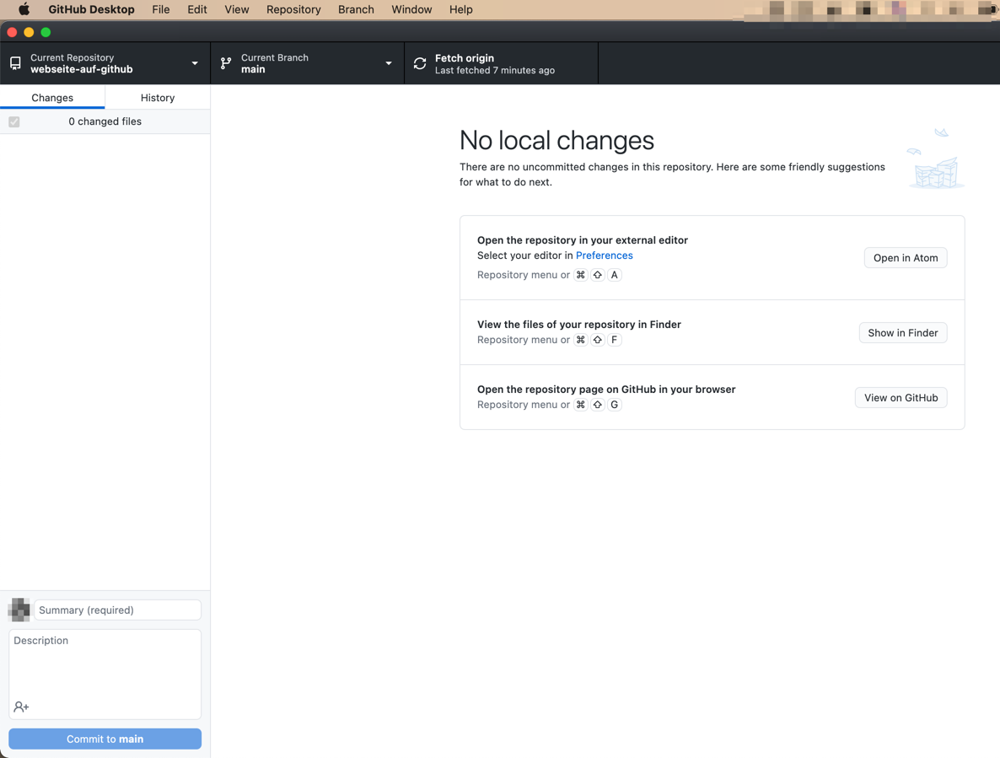

Öffnen Sie nun GitHub Desktop.
Wählen Sie dann mit Hauptmenu "File > Clone Repository" aus.
In dem sich öffnenden Dialog, gehen Sie zu dem Tab "URL".
Fügen Sie dann die URL in der Zwischenablage in das Eingabefeld ein.
Prüfen Sie, ob in "Local Path" der richtige Pfad eingetragen ist, in das Sie das Repository kopieren möchten.
Klicken Sie schließlich auf den "Clone" button.

Es öffnet sich daraufhin in GitHub Desktop das geklonte Repository.

