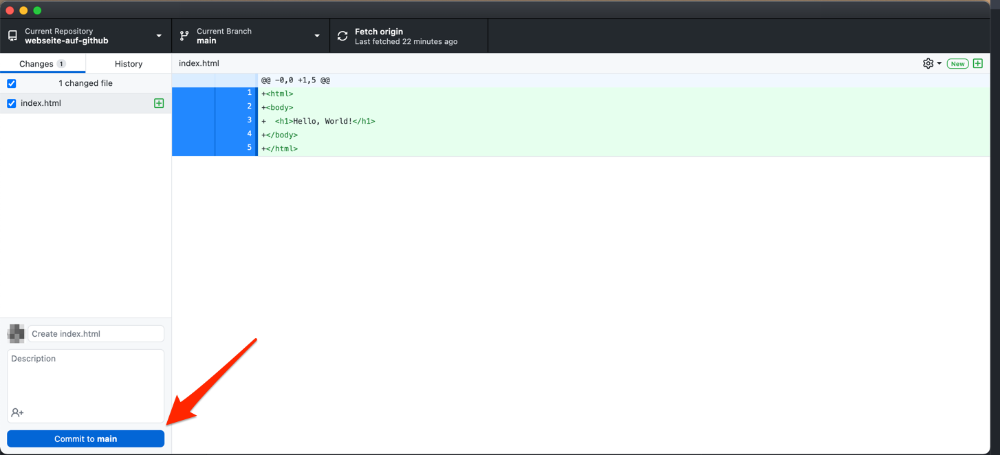

Gehen Sie nun zurück zu GitHub Desktop.
Es wird Ihnen hier angezeigt welche Dateien sich geändert haben.
Sie können nun auswählen, welche der Änderungen in den Commit beinhaltet sein sollen.
In diesem Fall wollen wir alle Änderungen in den Commit packen, was die Voreinstellung ist.

Drücken Sie daher einfach auf den "Commit to main" Button, um den Commit zu erstellen.

