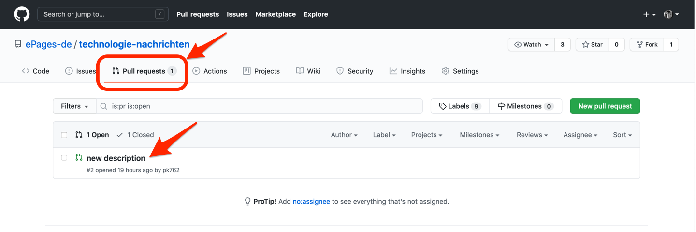
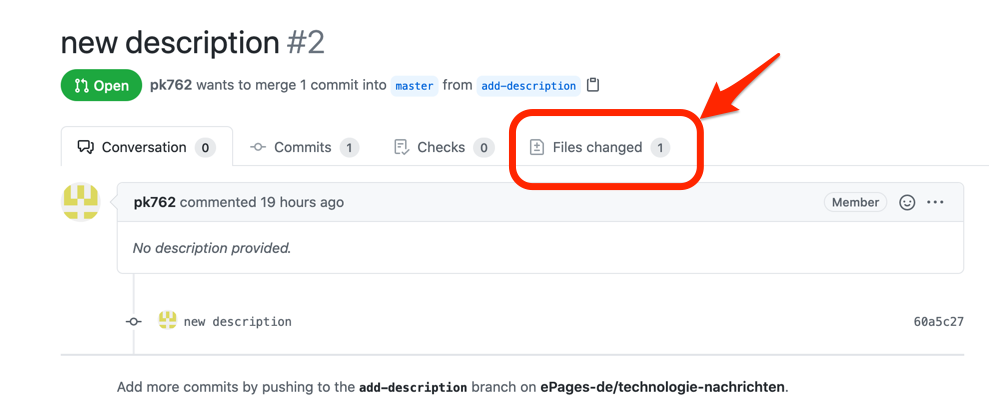

Gehen Sie auf das Hauptprojekt und öffnen Sie dort das "Pull Requests" Tab.

[https://github.com/ePages-de/technologie-nachrichten/pulls](https://github.com/ePages-de/technologie-nachrichten/pulls)

In den Details zu dem Pull Request, wechsel Sie zu dem "Files changed" Tab.

