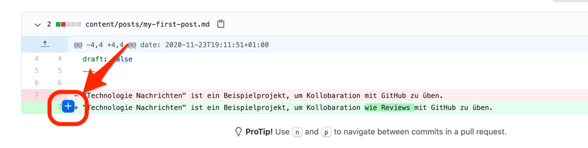
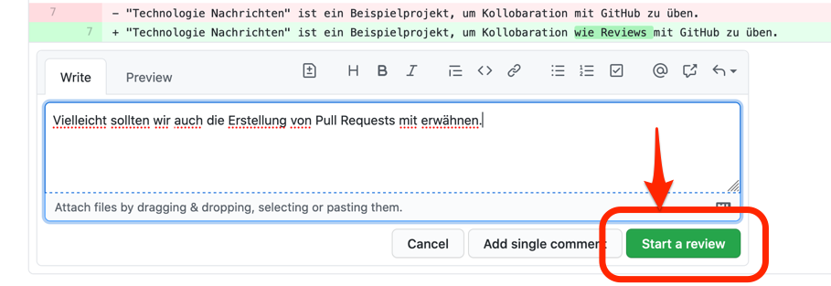

Beim Überfahren der geänderten Zeilen mit dem Mauszeiger können sie einen blauen Button am Beginn der Zeile sehen.

Wenn Sie diesen drücken öffnet sich eine Eingabemaske, in der Sie dem Autor des Pull Requests Feedback zu dieser Zeile geben können.

