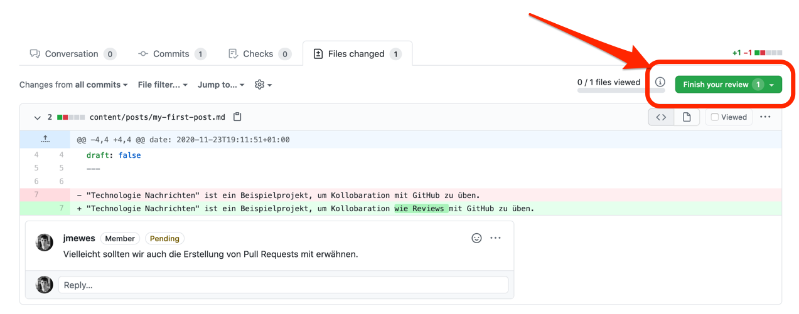

Wenn Sie mit Ihrem Review fertig sind, drücken Sie den Button rechts oben mit der Aufschrift "Finish your review".

Bevor Sie den sich daraufhin öffnenden Dialog bestätigen, müssen Sie entscheiden ob Sie den Pull Request nur Kommentieren möchten, ob Sie den Pull Request genehmigen oder Änderungen anfordern wollen.

Der Autor des Pull Requests bekommt daraufhin von GitHub eine Email als Notifikation für Ihr Feedback.
