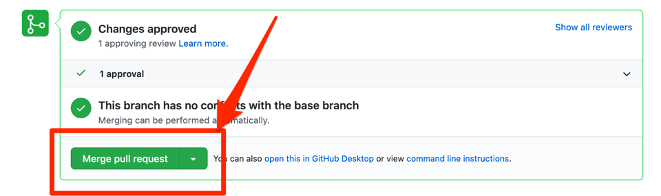

Wechseln Sie danach in das "Conversation" Tab in den Pull Request Details und scrollen Sie ganz nach unten.
Dort können Sie dann über den "Merge pull request" Button den Pull Request in den Hauptzweig des Repositories mergen.

