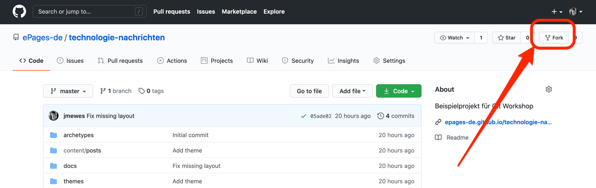
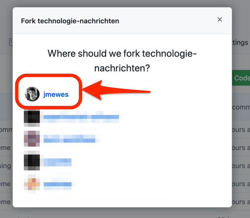
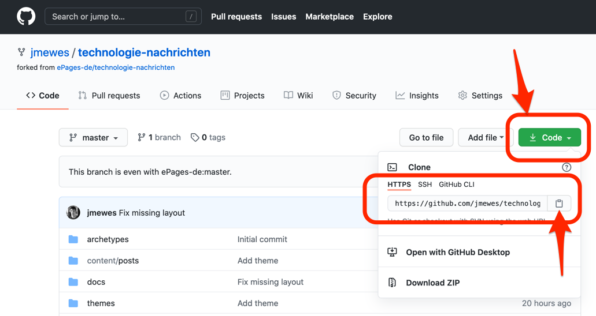

Als Übungsprojekt werden wir im Folgenden das "Technologie Nachrichten" Projekt benutzen:

[https://github.com/experimental-software/technologie-nachrichten](https://github.com/experimental-software/technologie-nachrichten)

TODO: Das Repository muss noch angelegt werden.

Besuchen Sie die Projektseite und klicken Sie dann auf den "Fork" Button rechts oben auf der Webseite.

Wählen Sie in dem sich daraufhin öffnenden Dialog Ihren privaten GitHub Account als Ziel für den Fork aus.

Nachdem die Fork Aktion fertig ist, klicken Sie auf den grünen "Code" Button und kopieren Sie sich dann die angezeigte HTTPS Clone URL.

