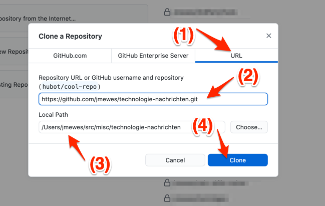
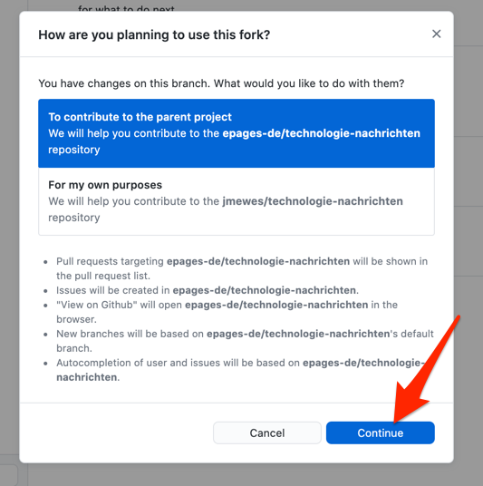

Öffnen Sie nun GitHub Desktop und wählen Sie den Menüpunkt "File > Clone Repository" aus.

Führen Sie in dem sich daraufhin öffnenden Dialog folgende Schritte durch:

1. Wechseln Sie zu dem Tab "URL"
2. Tragen Sie in dem Eingabefeld für die Repository URL die im vorherigen Schritt kopierte HTTPS Clone URL ein
3. Prüfen Sie, dass das Projekt an eine geeignete Stelle auf Ihrem Rechner heruntergeladen wird. Ggf. Können Sie über den Button rechts von dem Eingabefeld ein anderes Zielverzeichnis auswählen.
4. Bestätigen Sie den "git clone" mit einem Klick auf den blauen "Clone" Button.

Wenn GitHub Desktop Sie daraufhin fragt, was Sie mit dem Fork vorhaben, bestätigen Sie, dass Sie Kontributionen zu dem ursprünglichen Projekt vorhaben.

