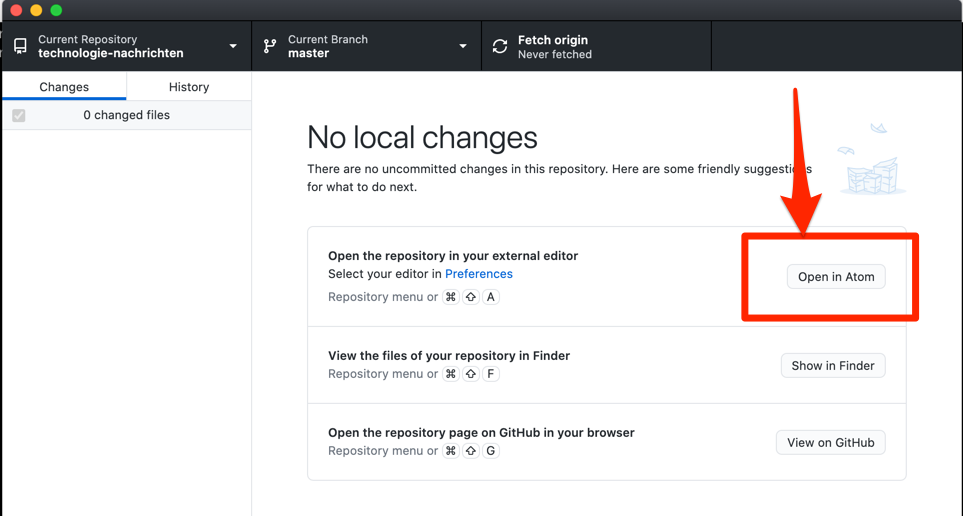

Wenn Ihr Texteditor richtig von GitHub Desktop erkannt wurde, können Sie nach der Verarbeitung von dem "git clone" Befehl einen Button mit der Beschriftung "Open in <text editor>", in dem folgenden Beispiel "Open in Atom":

Tip: Der von GitHub Desktop bevorzugte Texteditor lässt sich in den Einstellungen von GitHub Desktop ändern.

Daraufhin sollte sich der von Ihnen bevorzugte Texteditor in dem Verzeichnis von dem Übungsprojekt öffnen.

