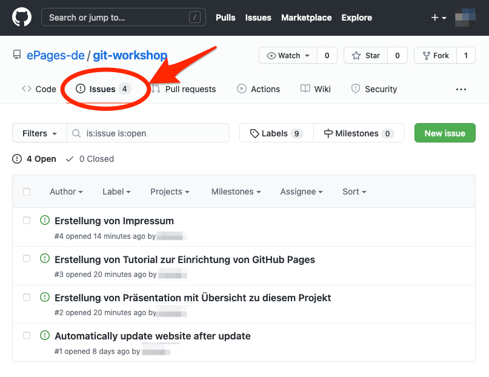

Wenn Sie das [Git Workshop Projekt auf GitHub](https://github.com/ePages-de/git-workshop) öffnen und dann auf das "Issues" Tab gehen, können Sie eine Liste mit den Aufgaben sehen, die hier noch anstehen:

