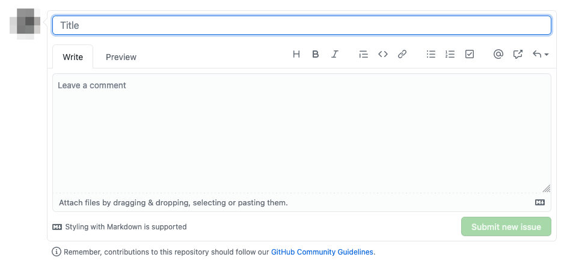

Wenn Sie auf der [Übersichtsseite der Tickets](https://github.com/ePages-de/git-workshop/issues) auf den grünen "New issue" Button klicken, bekommen Sie das folgende Formular angezeigt:

Um ein Ticket anzulegen müssen Sie in dem Eingabefeld "Title" eine Überschrift für die Aufgabe eintragen und dann auf den "Submit new issue" Button klicken.
Zusätzlich ist eine Beschreibung der Aufgabe in dem Eingabefeld "Leave a comment" in den meisten fällen hilfreich, so dass jede/r an dem Projekt beteiligte versteht, was zu tun ist.


In echten Projekten folgt die Beschreibung üblicherweise einem bestimmten Muster. So z.B. dem [User Story](https://stormotion.io/blog/how-to-write-a-good-user-story-with-examples-templates/) Muster für neue Funktionalitäten oder einer [Vorlage mit empfohlenen Sektionen](https://testlio.com/blog/the-ideal-bug-report/) für einen Fehlerbericht.


## Übung

Gehen Sie auf die [Webseite des Git Workshop](https://git-workshop.epages.works/) und schauen Sie die Tutorials und Präsentationen durch.
Denken Sie darüber nach, wie sie verbessert werden können, z.B. mit Hilfe der folgenden Fragen.

- War etwas in den Präsentationen unverständlich?
- Sind Sie beim Bearbeiten der Tutorials irgendwo auf Probleme gestoßen?
- Was für ein Tutorial könnten noch helfen?

Schauen Sie nächst in der Liste der offenen Tickets nach, ob es dafür bereits einen Eintrag gibt.
Wenn nicht, legen Sie hier ein Ticket mit Ihrem Verbesserungsvorschlag an (in Englisch oder Deutsch):

https://github.com/ePages-de/git-workshop/issues/new
