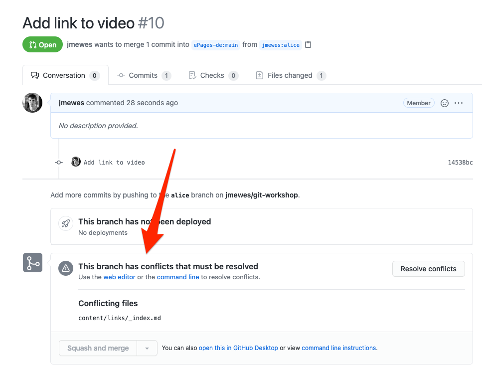

In Projekten an denen mehrere Personen arbeiten, kommt es hin und wieder vor, dass Änderungen gemacht werden, die Git nicht mehr automatisch zusammenführen kann.
Diese Situation wird auch als Merge Konflikt bezeichnet.
Dieses Tutorial beschreibt die Schritte, die notwendig sind um einen Merge Konflikt aufzulösen.

## Beispiel

Als Beispiel betrachten wir das folgende Scenario:

- Sie haben in der Datei `content/links/_index.md` in dem Abschnitt "Videos" einen Link zu einem neuen Video hinzugefügt.
- Während Sie dies getan haben hat jemand anderes in der Zeile darüber die Formatierung des Links geändert.
- Da Git für das Einfügen von Ihren Änderungen in die bearbeitete Datei die Zeilen davor und danach betrachtet, kann es jetzt nicht mehr entscheiden was getan werden soll.

Wenn Sie in diesem Scenario auf Ihren Pull Request schauen, werden Sie ein solches Bild sehen:

