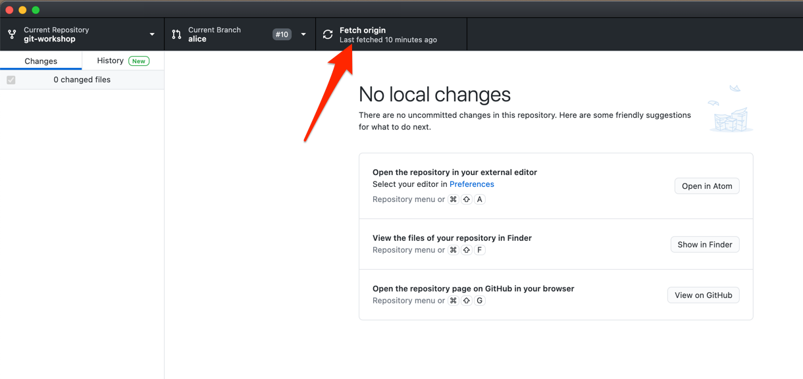

Mit Hilfe von dem `git fetch` Befehl können Sie die Git zu den Remote Repositories bekannten Daten aktualisieren.
Insbesondere muss nachgeschaut werden, was der letzte Commit auf dem "main" Branch in dem Upstream Repository ([ePages-de/git-workshop](https://github.com/ePages-de/git-workshop)) ist.

## GitHub Desktop

Um den `git fetch` Befehl auszuführen, klicken Sie auf den "Fetch origin" Button in GitHub Desktop.

