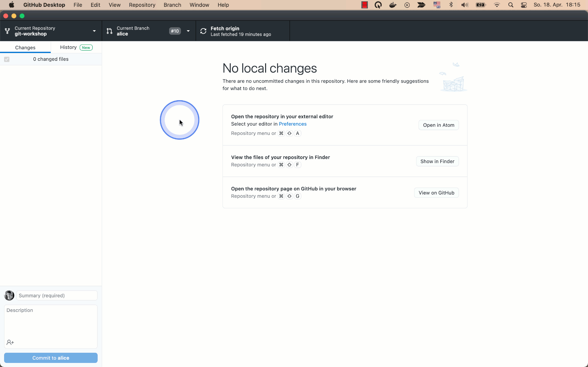

Als nächstes müssen Sie Ihren lokalen Branch mit den neusten Änderungen auf dem "main" Branch des "upstream" Repository zusammenführen.
Diese Aktion wird als "git merge" bezeichnet.

## GitHub Desktop

Klicken Sie dazu zunächst auf den Button für die Branch-Verwaltung.
In dem sich öffnenden Menü, klicken Sie auf den Button ganz unten, um einen Branch in den aktuellen Branch hinein zu mergen.
Wählen Sie in dem sich öffnenden Dialog den Branch "upstream/main" aus.

## Referenzen

- [Git Merge](https://www.atlassian.com/git/tutorials/using-branches/git-merge) - atlassian.com
- [Einfaches Branching und Merging](http://blog.jinlaixu.net/books/ProGit/de/437c34e7865e1881c12fd5ecc46c1cc5/9f23413d05603f9acb7cf39ad6436393.html) - ProGit
