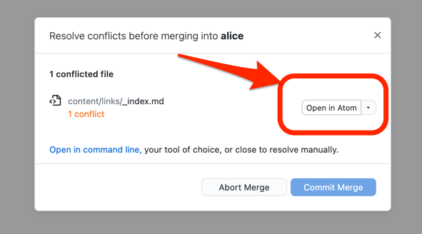

Nun müssen Sie Git darüber in Kenntnis setzen, wie der Merge Konflikt aufgelöst werden kann.

## GitHub Desktop

Nach der Durchführung von dem `git merge` Befehl zeigt Ihnen GitHub Desktop, in welchen Dateien es zu einem Merge Konflikt gekommen ist.
Es bietet Ihnen an, direkt diese Datei in Ihrem Text Editor zu öffnen, z.B. Atom.



## Text Editor

### Merge Konflikt Markierung

Wenn Git während des Merging einen Konflikt erkennt, dann fügt es an dieser Stelle sowohl die Version der Textstelle auf dem aktuellen Branch als auch die Version der Textstelle auf dem gemergten Branch ein.

```md
### Videos

- [Tech Talk: Linus Torvalds on git](https://www.youtube.com/watch?v=4XpnKHJAok8) - youtube.com
<<<<<<< HEAD
- https://www.udemy.com/course/git-versionsverwaltung-fuer-einsteiger/
- [Git Tutorial for Beginners: Command-Line Fundamentals](https://www.youtube.com/watch?v=HVsySz-h9r4) - youtube.com
=======
- [Git - Versionsverwaltung für Einsteiger](https://www.udemy.com/course/git-versionsverwaltung-fuer-einsteiger) - udemy.com
>>>>>>> upstream/main

## Grundlagen
```

- Der Start der Textstelle auf dem aktuellen Branch wird mit dem zusätzlich eingefügten Text `<<<<<<< HEAD` markiert.
- Das Ende der Textstelle auf dem aktuellen Branch wird durch `=======` markiert.
- Daraufhin folgt die entsprechende Textstelle auf dem gemergten Branch.
- Das Ende der Textstelle auf dem gemergten Branch wird durch `>>>>>>>` gefolgt von dem Branch Name markiert.

### Merge Konflikt Lösung

Sie müssen nun die beiden markierten Textstellen vergleichen und dann folgende Fragen beantworten:

1. Welche Änderungen wollte ich hier machen?
2. Welche Änderungen wurden in dem anderen Branch gemacht?
3. Wie können diese beiden Änderungen zusammengeführt werden?

Editieren Sie dann die Textdatei, indem Sie den markierten Bereich mit dem Text aus Frage 3 ersetzen.
Achten Sie darauf, dass keine der Markierungen sich mehr in der Textdatei befindet.

Die Lösung könnte in dem Beispiel folgendermaßen aussehen:

```md
### Videos

- [Tech Talk: Linus Torvalds on git](https://www.youtube.com/watch?v=4XpnKHJAok8) - youtube.com
- [Git - Versionsverwaltung für Einsteiger](https://www.udemy.com/course/git-versionsverwaltung-fuer-einsteiger) - udemy.com
- [Git Tutorial for Beginners: Command-Line Fundamentals](https://www.youtube.com/watch?v=HVsySz-h9r4) - youtube.com

## Grundlagen
```


## Referenzen

- [Git merge conflicts](https://www.atlassian.com/git/tutorials/using-branches/merge-conflicts) - atlassian.com
- [Fortgeschrittenes Merging](https://git-scm.com/book/de/v2/Git-Tools-Fortgeschrittenes-Merging) - ProGit
