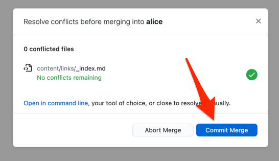

Nun können Sie einen neuen Commit erstellen, in dem die Information über Ihre Entscheidung zu der Auflösung des Merge Konflikt gespeichert wird.

## GitHub Desktop

Wenn Sie zurück zu GitHub Desktop gehen, wird es erkennen, dass der Merge Konflikt aufgelöst wurde.
Sie können den Merge Commit erstellen, indem Sie auf den "Commit Merge" Button klicken.

