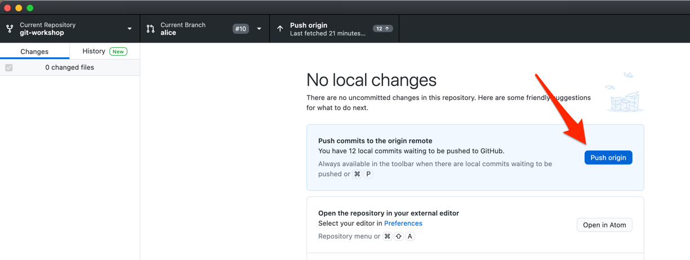

Der letzte Schritt zur Lösung des Merge Konflikt ist es, die Änderungen von dem lokalen Branch auf den Branch in dem Remote Repository zu publizieren.

## GitHub Desktop

Drücken Sie dazu in GitHub Desktop auf den "Push origin" Button.

