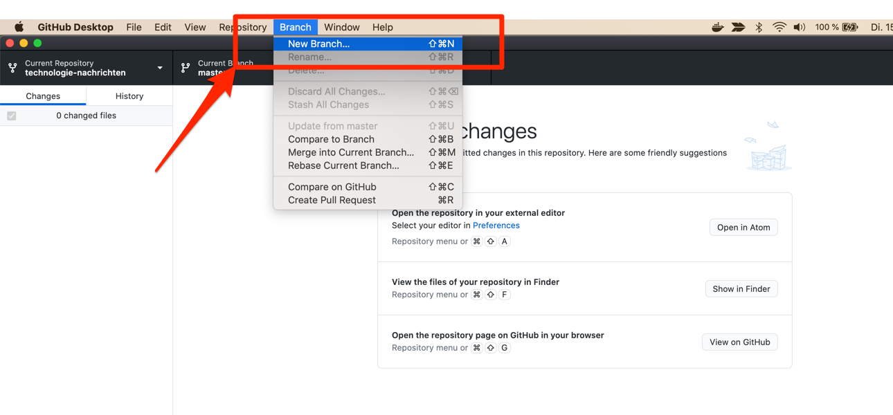
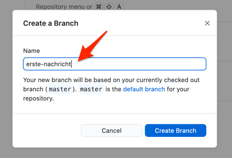
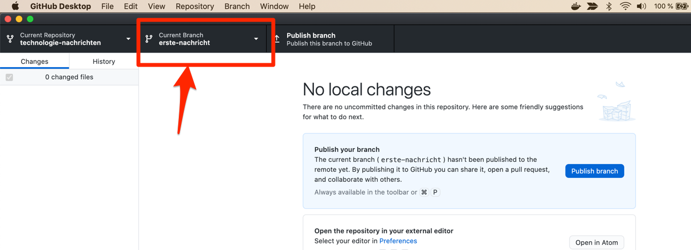

Der erste Schritt vor dem Hinzufügen von Änderungen an kollaborativ bearbeiteten Projekten sollte es immer sein, einen Branch anzulegen.

Wählen Sie dazu unter dem Menüpunkt "Branch" die Option "New Branch..." aus.

Welchen Namen Sie Ihrem Branch geben bleibt Ihnen überlassen.

Nach der Bestätigung dieses Dialogs können Sie in der Kopfzeilen von GitHub Desktop sehen, dass der Branch von dem Haupt-Branch "master" auf den von Ihnen ausgewählten gewechselt hat.

