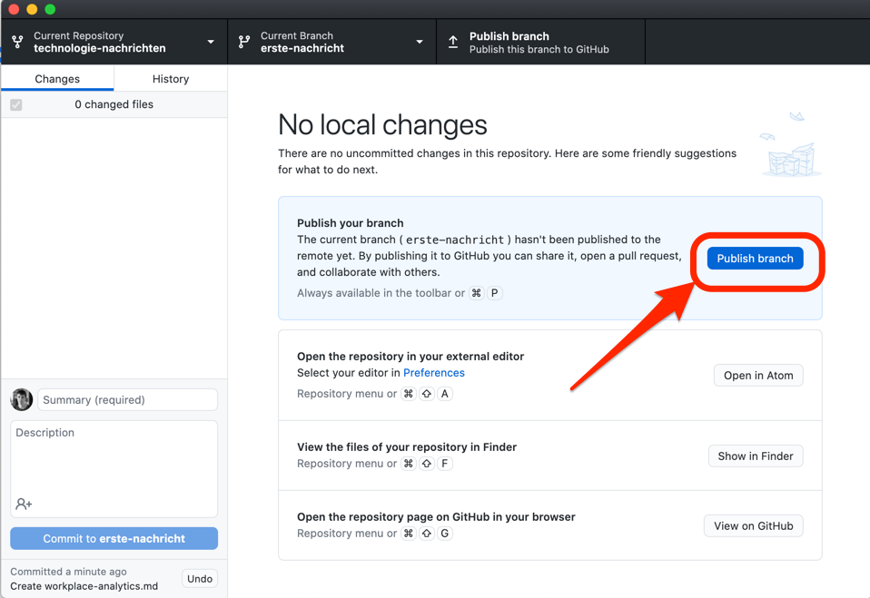

Nun klicken Sie auf den "Publish branch" Button, um die lokal ausgeführten Aktionen zu ihrem Fork auf GitHub zu publizieren.

An dieser Stelle erscheint dann ein Button "Create Pull Request". Der Übung halber erstellen wir den Pull Request jedoch für's erste in der Weboberfläche.
