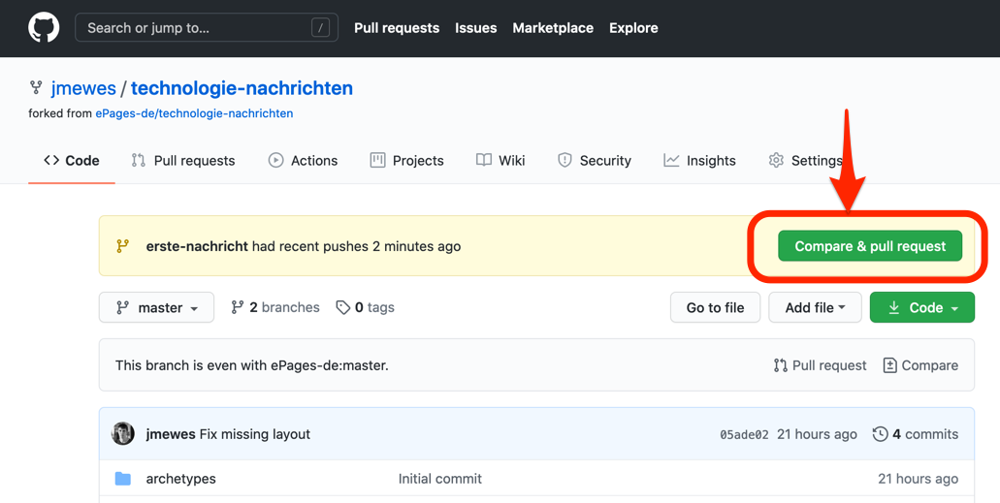
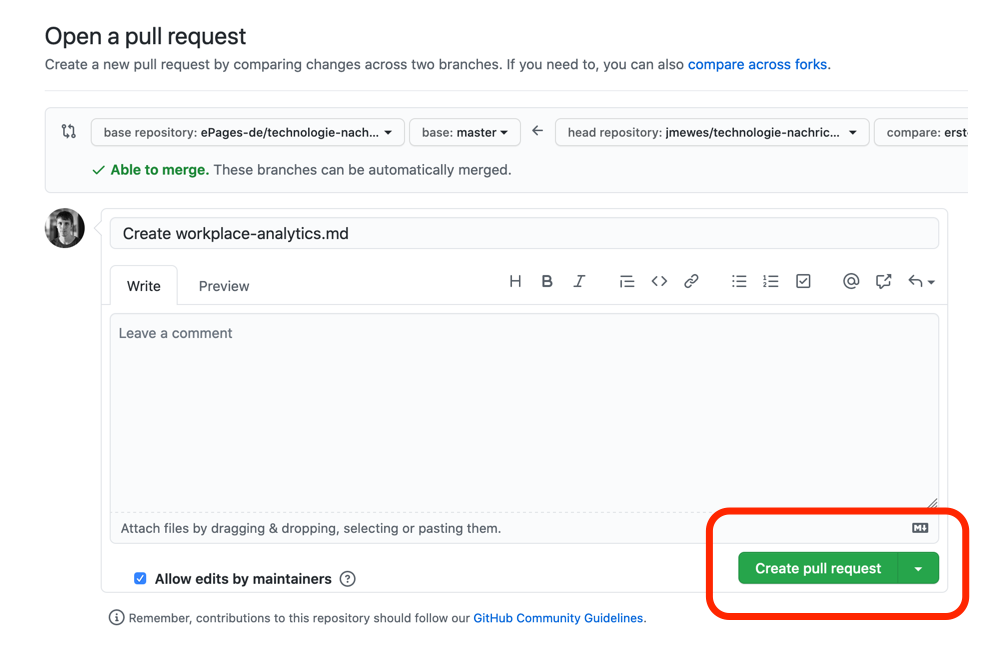
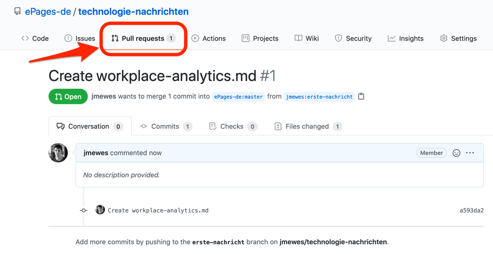

Wenn Sie Ihren Fork in der Weboberfläche öffnen, wird GitHub Sie über die Änderungen informieren und Ihnen auch dort anbieten einen Pull Request anzulegen.

Klicken Sie auf den "Compare & pull request" Button, überprüfen Sie die unten auf der Seite angezeigten Änderungen und bestätigen Sie dann die Pull Request Erstellung mit einem Klick auf "Create pull request".

Nun ist Ihr Pull Request im "Pull requests" tab des Hauptprojektes sichtbar und kann von den Projekt-Betreuern dort aufgenommen werden.

