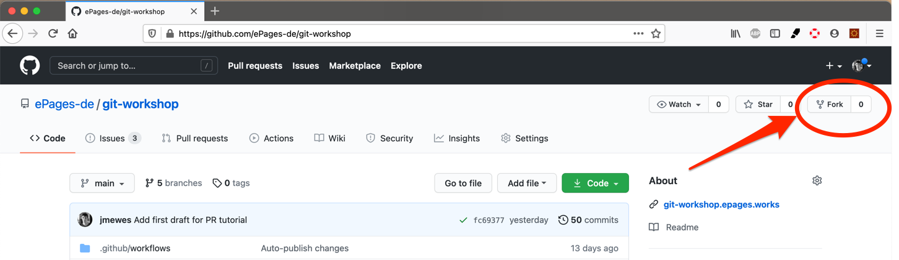
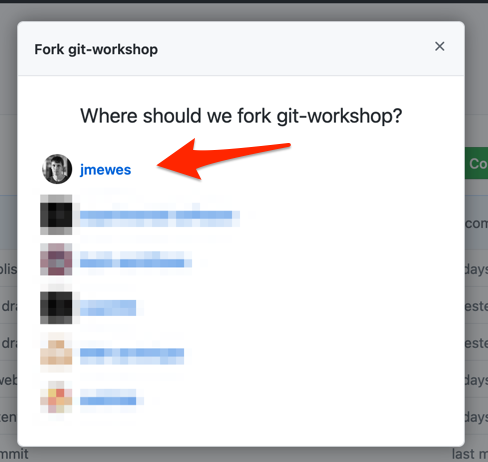

Der erste Schritt, um einen Pull Request ist es, sich einen [Fork](https://en.wikipedia.org/wiki/Fork_(software_development)) zu erstellen.
Als Fork wird die Kopie des Projektes in Ihrem persönlichen GitHub Account bezeichnet.

## GitHub Webseite

Besuchen Sie die [Projektseite](https://github.com/ePages-de/git-workshop) und klicken Sie dann auf den "Fork" Button rechts oben auf der Webseite.

Wählen Sie in dem sich daraufhin öffnenden Dialog Ihren privaten GitHub Account als Ziel für den Fork aus.

