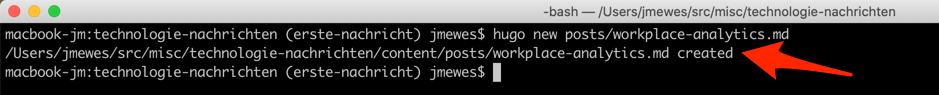
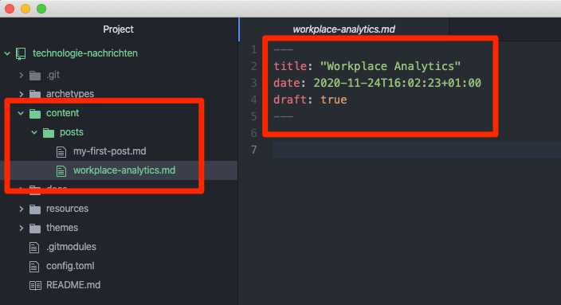
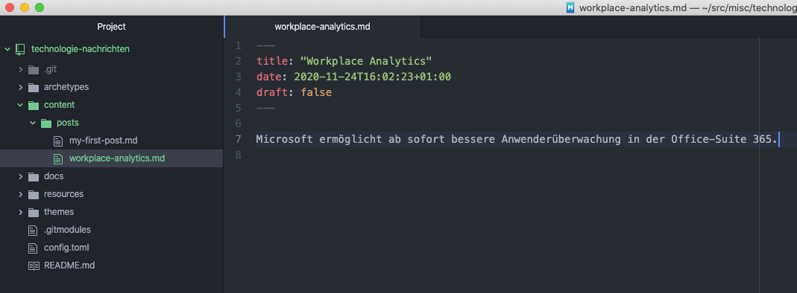

Öffnen Sie nun die Eingabeaufforderung und wechseln Sie in das Projektverzeichnis:

Windows:

```
cd d:\src\misc\technologie-nachrichten
```

MacOS / Linux:

```
cd ~/src/misc/technologie-nachrichten
```

Mit dem nächsten Befehl können wir mit Hilfe von Hugo automatisch eine neue Textdatei in dem Projekt anlegen.
Starten Sie die Eingabe mit "hugo new", gefolgt von dem Pfadelement "posts/", dann Schlagworten für Ihre Nachrichtenmeldung und zum Schluss die Dateiendung ".md".

```
hugo new posts/workplace-analytics.md
```

Tip: Folgende Webseiten könnten als Inspiration für Ihre Technologie Nachrichten interessant sein:

- https://www.heise.de/
- https://news.ycombinator.com/
- https://www.reddit.com/r/java/
- https://www.reddit.com/r/react/

Daraufhin wird Ihnen Hugo bestätigen, dass die Datei erfolgreich angelegt wurde.



Öffnen Sie nun die Datei in Ihrem Texteditor. Hier ein Bespiel für die ursprünglichen Inhalte der generierten Datei.



In den Zeilen 2 bis 4 finden Sie die Metadaten zu dem Artikel. Die Metadaten sind eingegrenzt von den Trennzeichen in Zeile 1 und 5. Wenn "draft" (dt. Entwurf) mit "true" konfiguriert ist, heißt das, dass Sie den Artikel noch nicht sehen werden wenn das HTML für die Webseite generiert wird, es sei denn es wird beim Kompilieren des HTML Codes der entsprechende Parameter gesetzt, dass auch Entwürfe mit gerendert werden sollen.

Ändern Sie nur den Wert von "draft" von "true" zu "false" und geben Sie in Zeile 7 eine kurze Nachricht ein.


