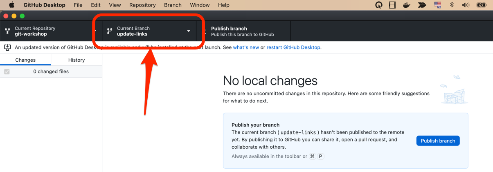

Jedes mal wenn man eine Änderung an einem Projekt macht, an dem mehrere Personen arbeiten, empfiehlt es sich zunächst einen neuen [Branch](https://www.atlassian.com/de/git/tutorials/using-branches) anzulegen.

## GitHub Desktop

Wählen Sie dazu unter dem Menüpunkt "Branch" die Option "New Branch..." aus.

Welchen Namen Sie Ihrem Branch geben bleibt Ihnen überlassen.

Nach der Bestätigung dieses Dialogs können Sie in der Kopfzeile von GitHub Desktop sehen, dass der Branch von dem Haupt-Branch "main" auf den von Ihnen ausgewählten gewechselt hat.

