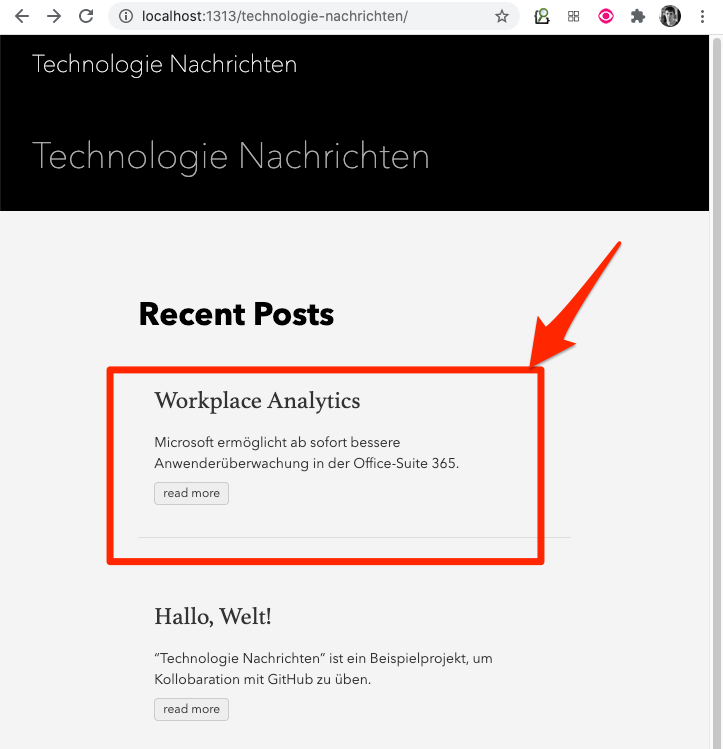

Um sich eine Vorschau der Webseite mit Ihrem neuen Artikel anzusehen, gehen Sie zurück zur Eingabeaufforderung, welche sich immernoch in dem Projektverzeichnis befinden sollte. Geben Sie nun dort das folgende Kommando ein:

```
hugo server -D
```


Daraufhin wird "hugo" den HTML Code generieren und die Webseite mit einem lokalen Webserver starten. Um sich diese anzeigen zu lassen, wechseln Sie zu einem Webbrowser und geben Sie dort in die Adresszeile folgende Adresse ein:

[http://localhost:1313/technologie-nachrichten](http://localhost:1313/technologie-nachrichten)

Der neue Artikel sollte nun auf der Startseite sichtbar sein.


