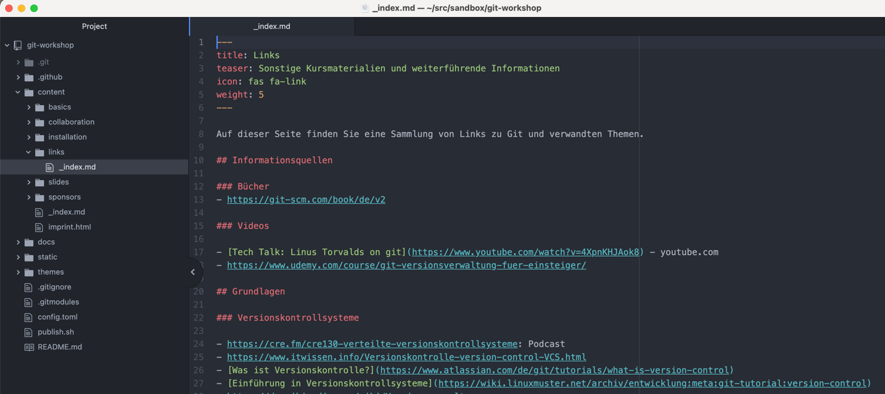
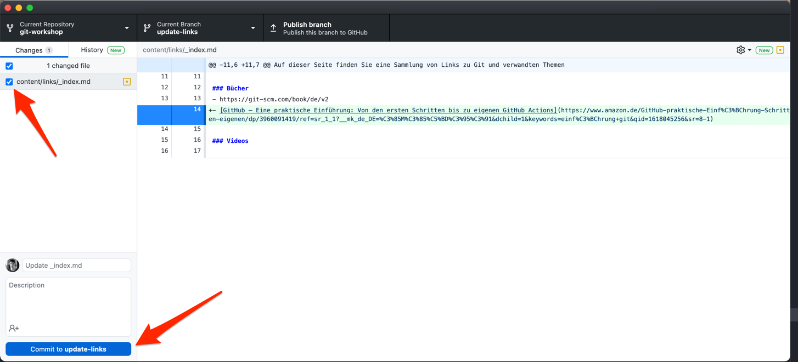

Nun können Sie eine Änderung an den lokalen Dateien von dem Git Workshop Projekt machen und diese in das lokale Repository hinzufügen.
Diese Aktion wird als "git commit" bezeichnet.

## GitHub Desktop

Auf der Übersichtsseite von dem Repository in GitHub Desktop macht Ihnen das Programm Vorschläge, was Sie als nächstes tun können.
Einer der Vorschläge ist es, den Quelltext von dem Repository in dem von Ihnen genutzten Texteditor zu öffnen.
In dem Beispiel Screenshot wird der Text Editor [Atom](https://atom.io/) genutzt.

Folgen Sie diesem Vorschlag, in dem Sie z.B. auf "Open in Atom" klicken.


Der von GitHub Desktop bevorzugte Texteditor lässt sich in den Einstellungen von GitHub Desktop ändern.


## Texteditor

Nachdem sich Ihr Texteditor geöffnet hat, gehen Sie dort zu der Datei `content/links/_index.md`.
Fügen Sie dort einen neuen Link hinzu oder verbessern Sie die Strukturierung der bestehenden Linksammlung.

## GitHub Desktop

Nach dem Speichern der Datei in Ihrem Texteditor, gehen Sie zurück zu GitHub Desktop.
Dort werden Ihnen die Differenzen zwischen dem Stand des Repository vor Ihren Änderungen und nach Ihren Änderungen angezeigt.
Sie können mittels der Kontrollkästchen in dem "Changes" Tab in der Toolbar am linken Bildschirmrand die Änderungen auswählen, welche Sie in das Git Repository aufnehmen wollen.
Alle Änderungen sind initial vorausgewählt.
Belassen Sie es dabei und erstellen Sie einen neuen Commit, indem Sie auf den "Commit to update-links" Button klicken.


In den Textfeldern über dem "Commit to update-links" Button können Sie optional einen besseren Commit Titel als dem Default "Update _index.md" mitgeben und in dem "Description" Feld eine Erklärung für die gemachten Änderungen zu Protokoll geben.


## Referenzen

- Hier finden Sie eine Beschreibung der Markdown Syntax: https://daringfireball.net/projects/markdown/syntax#link
