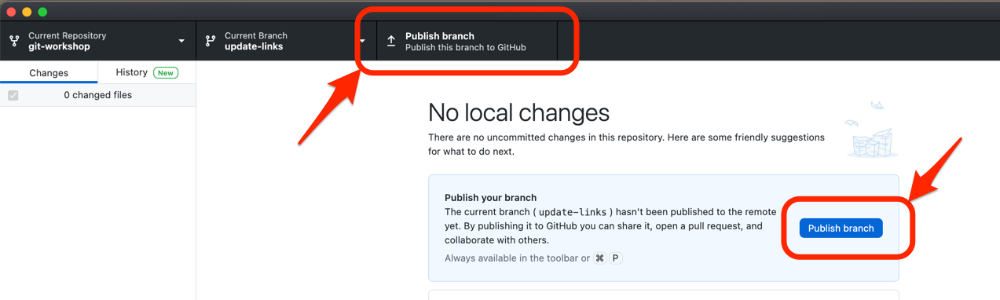

Nach der Erstellung des Commits ist dieser erst einmal nur auf Ihrem lokalen Repository verfügbar.
Einen Pull Request kann man jedoch nur von einem Remote Repository zu einem anderen Remote Repository stellen.
Von daher muss der Branch mit dem Commit zu Ihrem Fork publiziert werden.
Diese Aktion wird als "git push" bezeichnet.

## GitHub Desktop

Nun klicken Sie auf einen der "Publish branch" Buttons, um den lokal erstellten Branch mit dem neuen Commit zu ihrem Fork auf GitHub zu publizieren.

In den vorgeschlagenen Aktionen wird danach ein Button "Create Pull Request" angezeigt.
Der Übung halber erstellen wir den Pull Request jedoch für's erste in der Weboberfläche.
