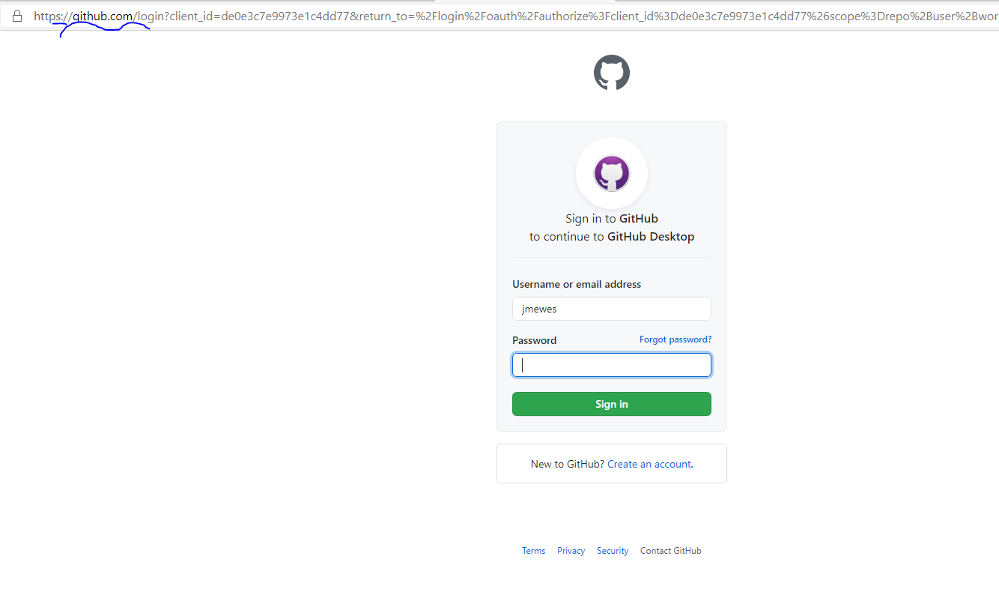
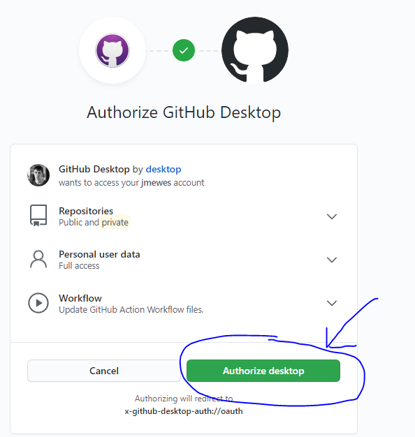
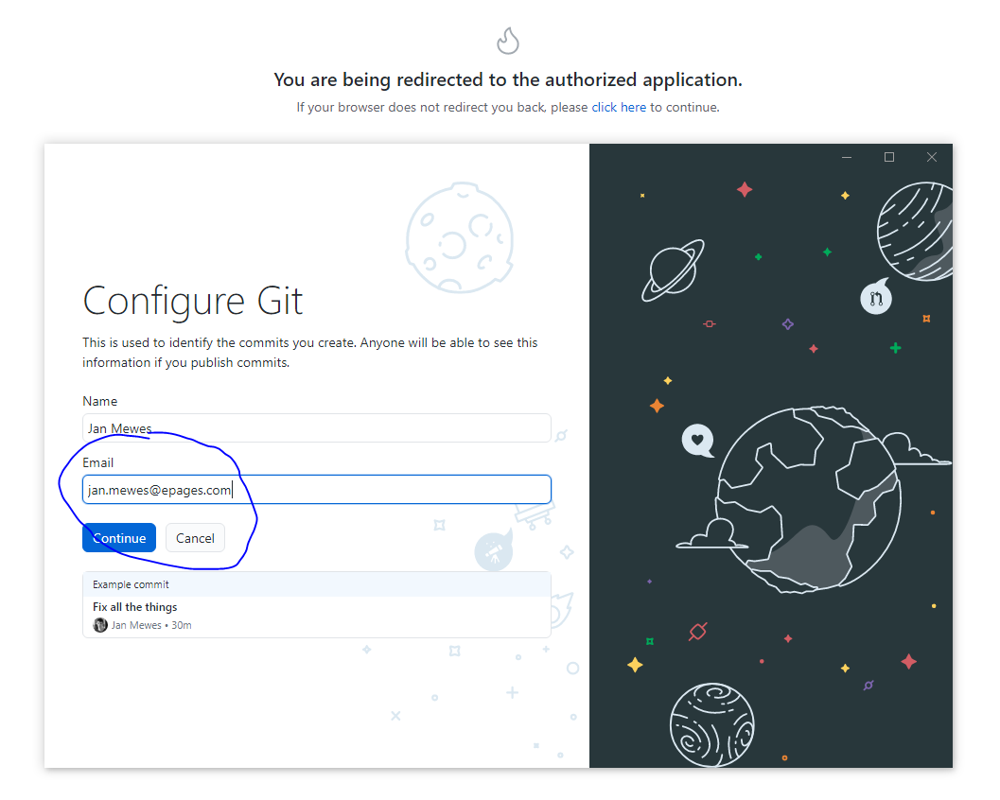
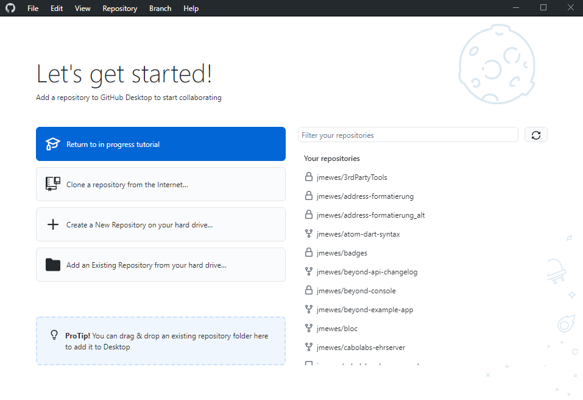

Beim ersten Start der Anwendung sollte sie mit GitHub verknüpft werden.

Überprüfen Sie, dass in der sich nach dem Klick auf diesen Button die Webseite "github.com" mit dem "https" Protokoll geöffnet hat und geben Sie dann ihren Benutzernamen und Ihr Passwort ein.

Bestätigen Sie, dass GitHub Desktop in Ihrem Namen auf der GitHub Plattform agieren darf.

Nach der Bestätigung von dem darauf folgenden Dialog werden die zu GitHub Desktop zurück geleitet und können die Konfiguration von Git abschließen.
Der eingetragene Name und die Email-Adresse wird dann später als Metainformation zu allen Ihren Änderungen in den Git Projekten hinzugefügt.

Im folgenden sehen Sie dann die eigentliche Startseite von GitHub Desktop.

