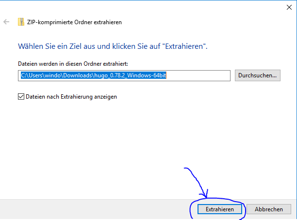

Gehen Sie nun zu Ihrem Download-Ordner und klicken Sie mit der rechten Maustaste auf die heruntergeladene ZIP-Datei.
Wählen Sie aus dem Kontextmenü "Alle extrahieren" aus.
Nun öffnet sich ein Dialog welcher abfragt wohin die Dateien extrahiert werden sollen.
Wählen Sie hier einen beliebigen Ordner aus, z.B. direkt in das Downloadverzeichnis:

