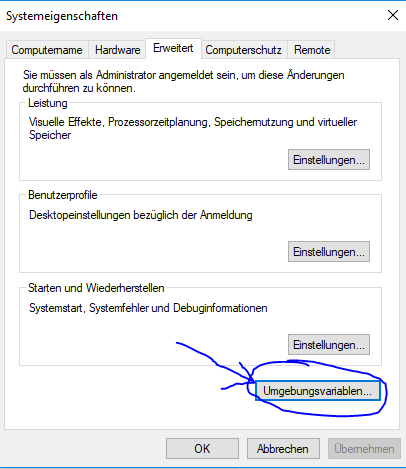
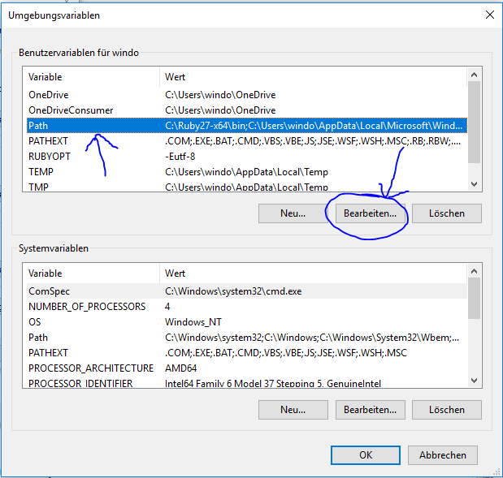

Gehen Sie nun zu der Sucheingabe der Windows Hauptnavigation und geben Sie dort das Wort "Umgebungsvariablen" ein.
Nach dem Öffnen des daraufhin gefundenen Programm öffnet sich der folgende Dialog, in welchem Sie als nächstes den Button "Umgebungsvariablen" drücken:

Hier wollen wir die Variable "Path" bearbeiten:

Hier muss nun der Ordner eingetragen werden, in den Hugo extrahiert wurde.

