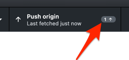
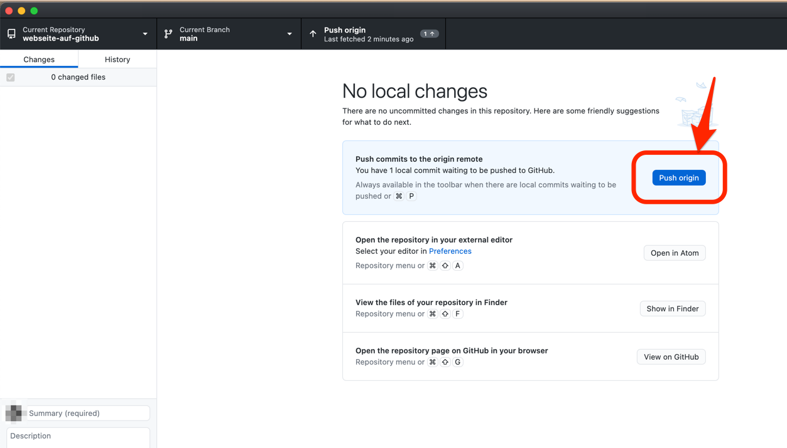

Nach der Erstellung des Commit zeigt Ihnen GitHub Desktop an, dass Ihr lokaler Branch einen Commit mehr hat, als der Branch den Sie remote auf GitHub haben.

Um diesen Commit dem remote Repository bekannt zu machen, müssen Sie den "git push" Befehl ausführen.
GitHub Desktop macht diese einfach, indem Sie nur den "Push origin" Button dafür klicken brauchen.

Wenn Sie sich nun Ihr Repository auf GitHub anschauen, können Sie nun die von Ihnen neu erstellte Datei finden.
