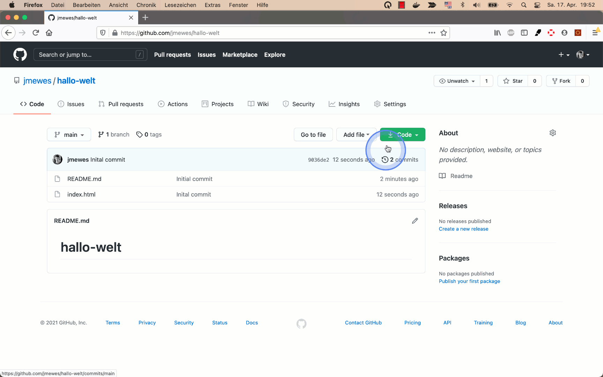
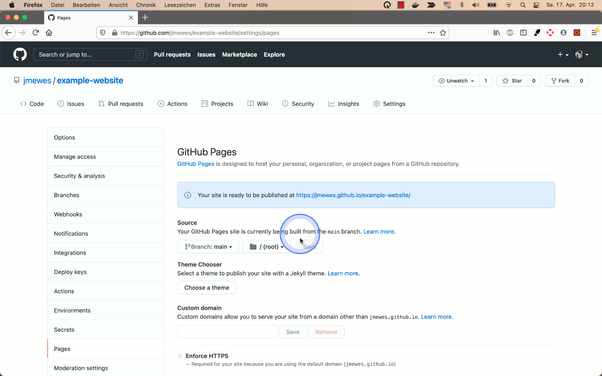

Gehen Sie nun wieder zu der GitHub Webseite.
Öffnen Sie dort das Repository.
Navigieren Sie in dem Repository zu dem "Settings" Tab.
Dort wählen Sie in den Menüpunkt "Pages" aus.

## Aktivieren

Um Ihre HTML-Datei mit GitHub Pages als Webseite zu publizieren, müssen Sie zuerst GitHub darüber informieren, in welchem Branch Ihre Webseite zu finden ist.

Danach muss konfiguriert werden, in welchem Order sich die HTML-Dateien befinden.
Dies kann entwerden im Hauptverzeichnis des Repository sein (engl. root) oder in einem Ordner mit dem Namen "docs".

Da GitHub Pages Cache-Mechanismen benutzt, ist Ihre Webseite nicht sofort verfügbar.
Es kann 1-10 Minuten dauern, bis die Webseite unter der angezeigten URL verfügbar ist. 

## Jekyll Theme

Wenn auch nach 10 Minuten immernoch nicht und Sie nicht mehrere Stunden darauf warten wollen, dass Ihre Webseite initialisiert wurde,
können Sie ein Jekyll Theme auswählen, auch wenn es keine Auswirkung auf die Darstellung Ihrer Webseite hat.

Nach Durchführung dieser Konfiguration sollte Ihre Webseite sofort erreichbar sein.

## Aktualisieren

Wenn Sie die "index.html" Datei in dem Git Repository aktualisieren, dann aktualisiert sich auch die Webseite nach ca. 1-10 Minuten.
